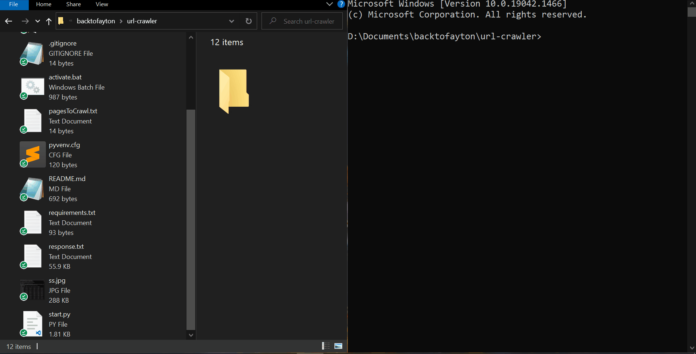

# URL parser

Parse the links from given set if URLs.

## Built With

- Python

## Getting Started
- Add the urls to be parsed into `pagesToCrawl.txt`
- Run `$ py start.py` on terminal
- See the parsed URLs at `links.txt`

## Authors

👤 **damdafayton**

- [Github](https://github.com/damdafayton)
- [LinkedIn](https://linkedin.com/in/damdafayton)

## 🤝 Contributing

Contributions, issues, and feature requests are welcome!

Feel free to check the [issues page](../../issues/).

## Show your support

Give a ⭐️ if you like this project!

## 📝 License

This project is [MIT](./MIT.md) licensed.